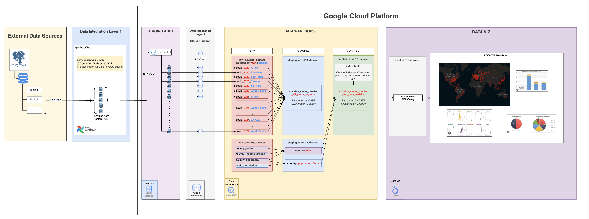
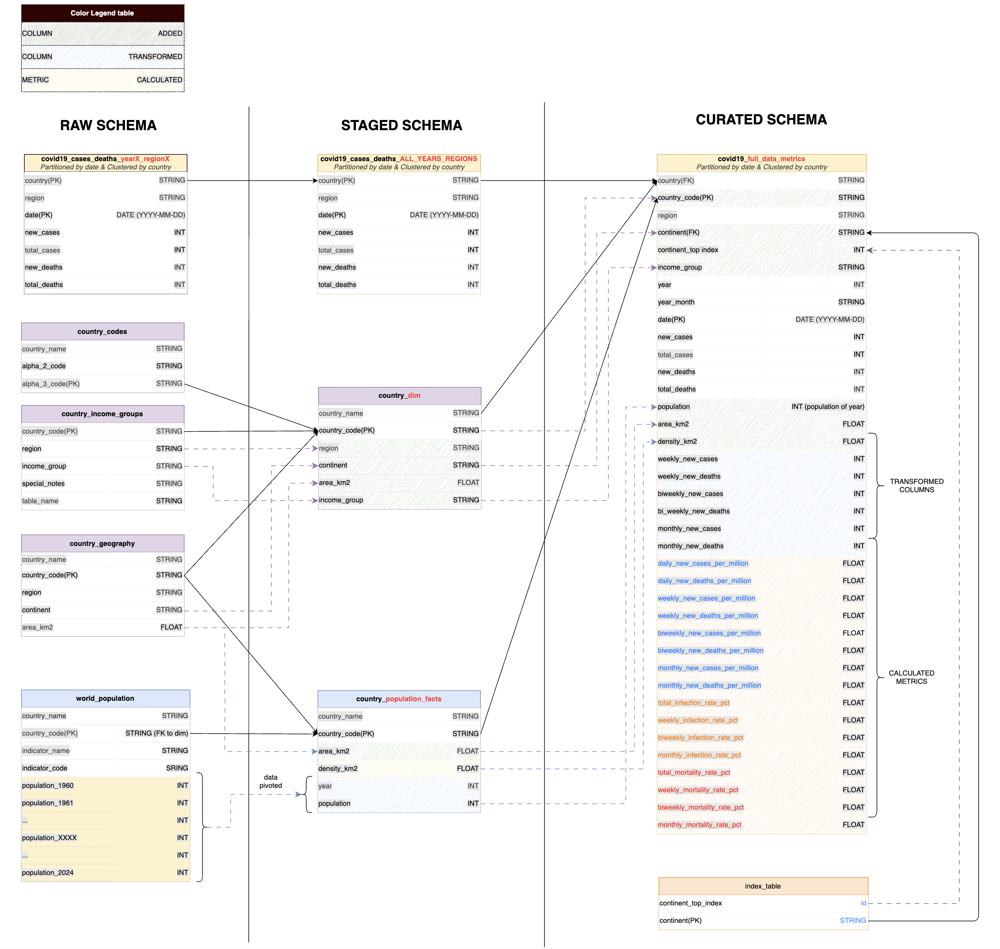
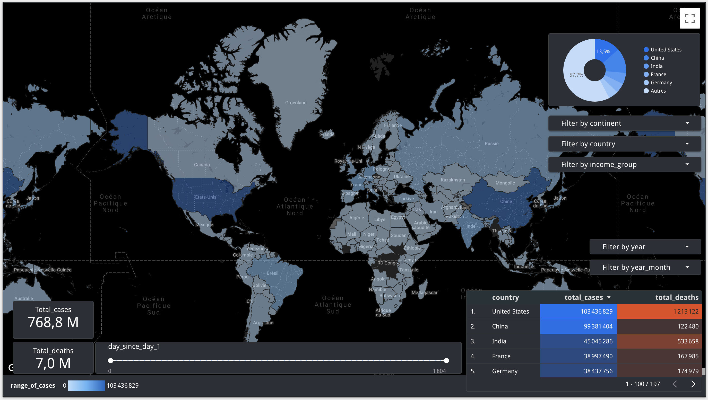
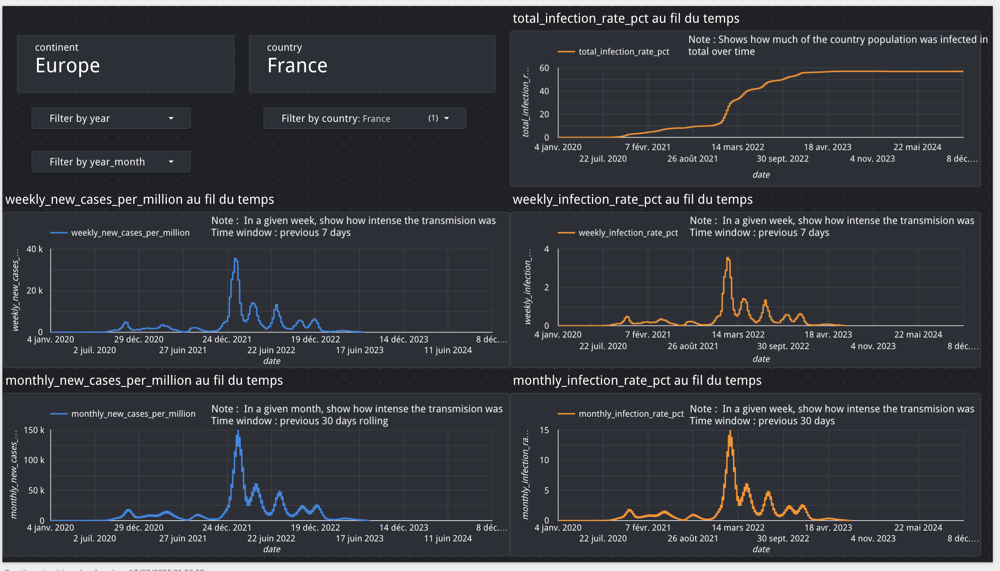
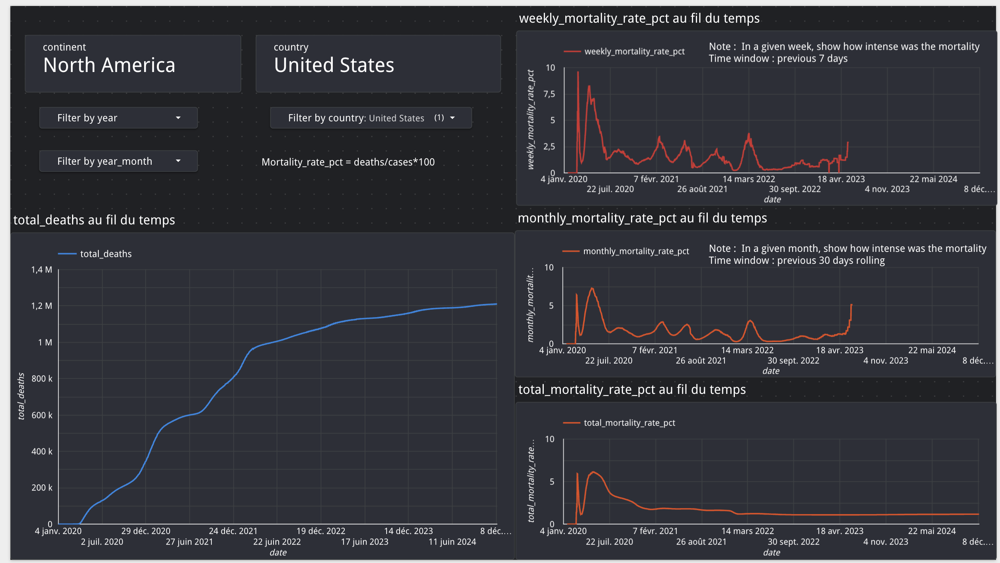
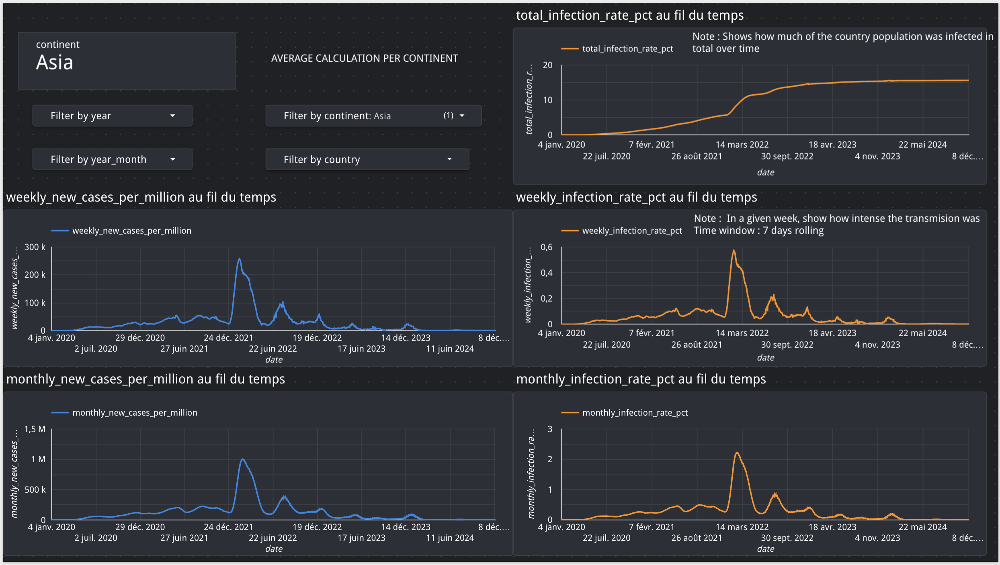
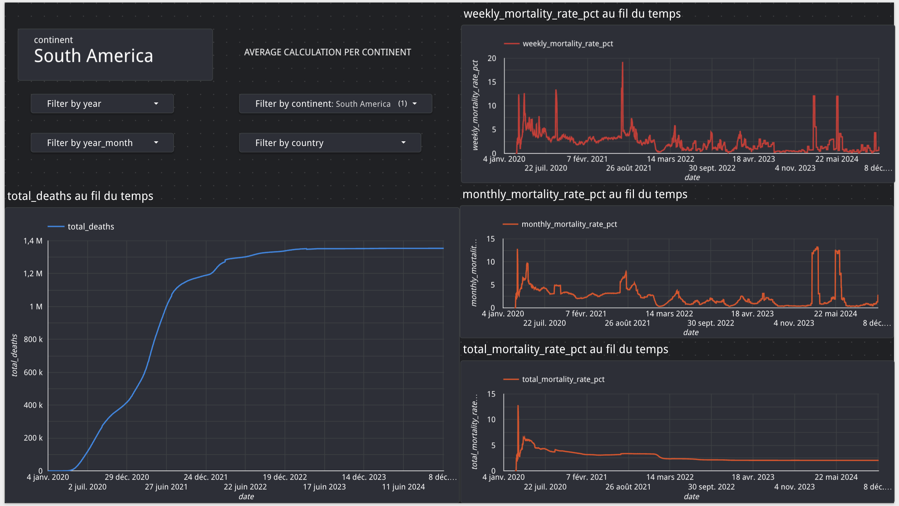
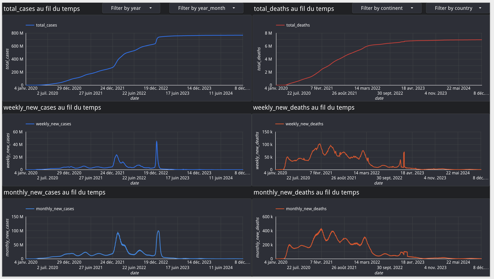

# GCP_Project_1_Covid-19

## About Project

The goal of this project is to make a Data Analysis of Covid-19 data from 2020 to 2025.
This project will be based on data from different sources.
The ouput will be different KPIs on Covid-19 including : Geo-Maps, Charts, ...

## References Sources

Dataset 2 - Our World : [ourworldindata.org/covid-cases](https://ourworldindata.org/covid-cases)

## DATA Architecture

## Data Schema

## Screenshots of Reports on Looker

### WORLD GEO MAP

### Country Reports

### Continent Reports

### Global Charts

